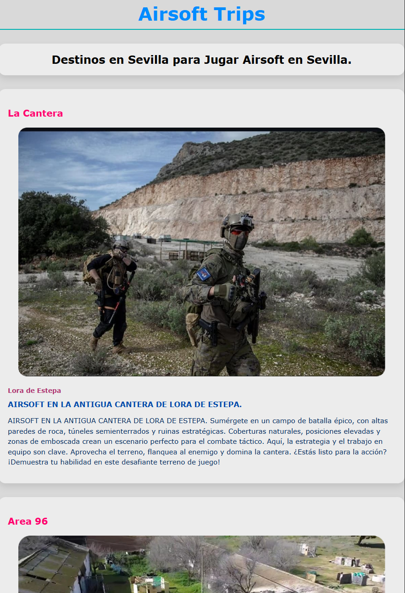

# Travel2

Este proyecto demuestra conceptos básicos de CSS, como el centrado de contenido, transiciones y transformación de texto.

Características
Centrado de texto en el medio de la pantalla.

Transiciones suaves para propiedades como transform y box-shadow.

Transformación de texto para poner en mayúscula la primera letra de cada palabra.

Instalación
Clona el repositorio:

git clone https://github.com/TU-USUARIO/nombre-del-repo.git
Abre el archivo INDEXpropio.html en tu navegador.

Uso
Centrado de texto: Usando Flexbox para centrar el contenido.

Transiciones: Animación de elementos cuando el usuario interactúa.

Texto capitalizado: Usando text-transform: capitalize para transformar el texto.

Licencia
Este proyecto está bajo la licencia MIT.

