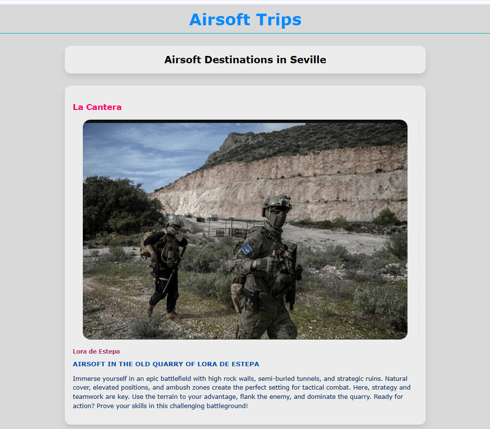
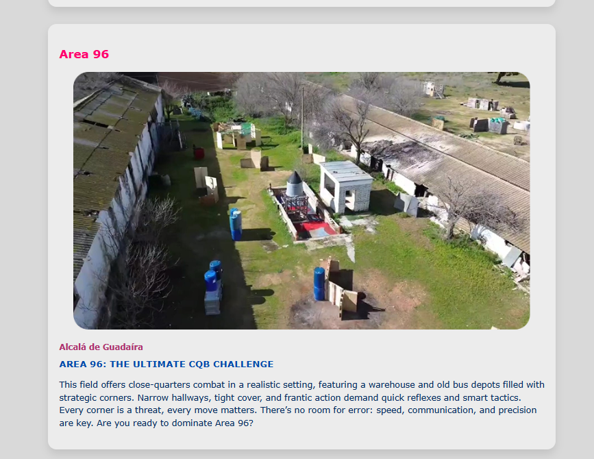
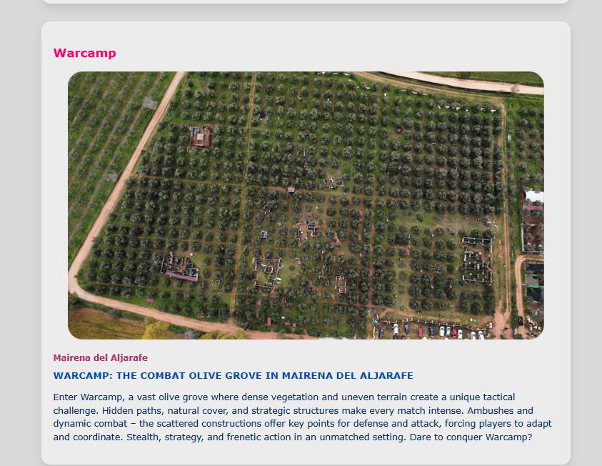
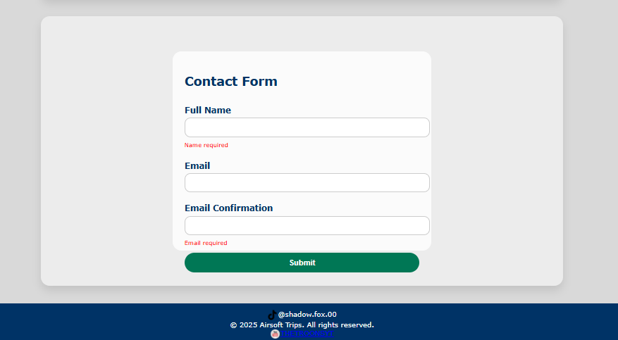

# Travel2

This project demonstrates basic CSS concepts such as content centering, transitions, and text transformation.

Features
Centered text in the middle of the screen.

Smooth transitions for properties like transform and box-shadow.

Text transformation to capitalize the first letter of each word.

Installation
Clone the repository:

bash
Copiar
Editar
git clone https://github.com/YOUR-USERNAME/repo-name.git
Open the INDEXpropio.html file in your browser.

Usage
Text Centering: Using Flexbox to center content.

Transitions: Animating elements when the user interacts.

Capitalized Text: Using text-transform: capitalize to transform the text.

License
This project is licensed under the MIT License.

